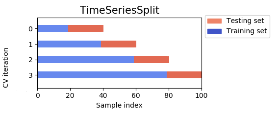

# Project 3 Report : Ridge Regression

## How the model works:
We used the same algorithm described in the slides for ridge regression,but with some enhancements. To solve the system, we used Cholesky (just like scikit-learn). Cholesky is a method for decomposing a symmetric, positive-definite matrix into a lower triangular matrix and its conjugate transpose $S=L L^T$ where $L$ is a lower triangular matrix and $S=\left(X^T X+\lambda I\right)$.It's better than direct inversion because it takes advantage of the specific nature of the matrix. Additionaly it's more efficient computationally and more robust in the case of ill-posed cases. Lets go over the algorithm in more detail:  
Since $S$ is symmetric and positive definite (ridge regression ensures this by adding $\alpha I$), Cholesky decomposition is applicable. The euqation now becomes:
$$
L L^T W=X^T Y
$$

This is done in two steps:
- First, solve $L z=X^T Y$ for $z$ using forward substitution (since $L$ is a lower triangular matrix, get the solution from the first line of the system and then  propagate it).
- Then, solve $L^T W=z$ for $W$ using backward substitution (since $L^T$ is an upper triangular matrix).
Note that we calculate the bias term separately to ensure the positive definiteness of the matrix. This is because we wouldn't regularize the bias, so we set a value in the matrix to 0, thereby breaking the assumption.

## Tetsing and fine tuning:
We must note that the data is temporal. That being said, we have to be extremely careful about how we perform the split, due to the temporal dependency. If we give the model future data and ask it to predict the past, it would perform very well, but this would be data leakage. Therefore, we use TimeSeriesSplit, a form of cross-validation that works in a manner that does not disrupt the time dependencies. Here is an intuitive illustration of how it works: 

We perform normalization for the years, ensuring that we only fit the normalizer on the training data and not the test data, to prevent data leakage. We noticed that after normalizing, we achieve better performance and the value of alpha doesn't have to be in the thousands.
$$year=\frac{(year-\mu)}{\sigma}$$
where $\mu$ is the mean of the years and $\sigma$ is the standard deviation. 

We select the alpha with the best TimeSeriesSplit cross-validation score. We use a grid search for this, keeping in mind that increasing alpha results in a simpler model, i.e., the bias increases and the variance decreases by imposing a penalty on the weights.

We also introduced polynomial features afterwards to better fit the data, which is not really linear. We chose degree 2 because a higher degree would result in overfitting the data, which is very simple and scarce in our case.
